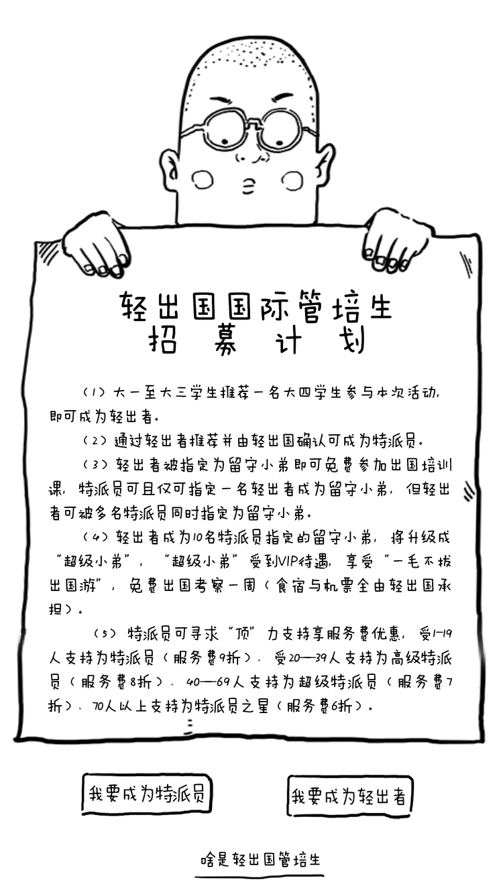

# HTML-area-Map-

&emsp;&emsp;HTML图片热区Area map的用法只是在上学的时候学习到过，在实际工作中一直没用过，如果 不是这次紧急任务，可能永远都不会想起这个功能。在一些特殊的html页面布局中巧用area，能省好多时间，达到事半功倍的效果。
   <!-- more -->
####  area简介
 - area标记
&emsp;&emsp;主要用于图像地图，通过该标记可以再图像地图中设定作用区域（热点），这样当用户鼠标移到指定作用区域时，鼠标默认会显示成<a></a>链接样式，点击会自动链接到预设好的页面，或者如果设置了onclick事件，会响应相应的点击事件。
    基本语法结构：[demo](http://www.w3school.com.cn/tiy/t.asp?f=html_areamap)
```

<map name="planetmap" id="planetmap">
  <area shape="circle" coords="180,139,14" href ="venus.html" alt="Venus" />
  <area shape="circle" coords="129,161,10" href ="mercur.html" alt="Mercury" />
  <area shape="rect" coords="0,0,110,260" href ="sun.html" alt="Sun" />
</map>

```
 - 用法简介：
	1. 一般 中的 usemap 属性可引用 <map> 中的 id 或 name 属性（由浏览器决定），所以我们需要同时向 <map> 添加 id 和 name 两个属性，以此来表示img与map之前的映射关系。
	2. <area>总是嵌套在<map>标签中，<area>表示在图像中的映射区域。
	3. shape和coords：shape定义鼠标敏感区域的形状（圆形，矩形，多边形），coords定义敏感区域的坐标。两者结合可以定义敏感区域的位置形状和大小。
	4. href 和 target ：href定义区域的目标链接，target定义何处打开href，方式与<a></a>中的target用法相同。
	5. area事件：area标签也支持[HTML 中的事件属性](http://www.w3school.com.cn/tags/tag_area.asp),比如常见的onclick，onload等事件。
	
  
####  特殊页面巧用area实例
&emsp;&emsp;area通常用在地图应用中，平时很少接触地图项目，所以渐渐快忘记这个标签了。最近的一个突发事件，让我对area的应用有了新的认识。临下班前，老板突然发给我十几个psd文件，让我做成html静态网页，莫说在临下班前写完十几个，写完四五个对我来说也是压力山大啊（ps：我已经将近两年没写过html页面了，这两年一直在做iOS），而且老板说了，要快！仔细研究了这些页面，虽然量大，但是大部分都是展示，只有少数几个地方需要点击跳转或者填写内容，那么对于这种主要作为展示又只是有少量点击功能的页面可以用area热点来快速实现。
   <div align=center></div>
   <div align=center></div>

   &emsp;&emsp;图1中有三个点击部分（红色标注），图2中有三个点击部分，其实这些布局用普通的html布局也很好实现，只是当需要在短时间内实现十多个这种界面，用点儿特殊的技巧可以快速满足要求。
   &emsp;&emsp;首先用photoshop等psd处理工具，标注出要点击部分（红色标注）的左上角和右下角的坐标生成如下代码（以图1为例）。
   ```
<body>
	<div class="div1">
		
		<map name="qcg01" id="qcg01">
 		 <area  id="area1" shape="rect" href="02222.html" alt="我要成为特派员" />
		 <area id="area2" shape="rect" coords="212,575,312,616" href="02.html" alt="我要成为轻出者" />
		 <area id="area3" shape="rect" coords="145,635,242,664" href="info.htm" alt="啥是轻出国管培生" />
		</map>
	</div>
</body>
   ```
   ------
   
    ```
	html,
	body {
		height: 100%;
	}

	.div1 {
		height: 100%;
		position: relative;
		float: left;
		left: 50%;
	}

	.div1 img {
		height: 100%;
		position: relative;
		left: -50%;
		display: block;
	}   		
    ```
    
 &emsp;&emsp;初看，基本符合要求，好像大功告成了，但是由于img的宽高不是原始值，而是根据浏览器的大小变化而变化的，所以，如果仅仅这样写，用到不同大小的浏览器上，点击的区域是值是写死的，所以最终效果不通用😓，但是在coords中设置百分比的值又行不通，最后是通过加js事件实现的。
    ```
	<script type="text/javascript" charset="utf-8">
		window.onload = function() {
		var img = document.getElementById("tpy1");
		var widthStr = img.width;
		var heightStr = img.height;
		
		var map1 = document.getElementById("area1");
		var map1X1 = parseInt(0.1613 * widthStr);
		var map1Y1 = parseInt(0.8643 * heightStr);
		var map1X2 = parseInt(0.4253 * widthStr);
		var map1Y2 = parseInt(0.913 * heightStr);
		var map1Coords=map1X1+","+map1Y1+","+map1X2+","+map1Y2;
		map1.coords=map1Coords;
		
		var map2 = document.getElementById("area2");
		var map2X1 = parseInt(0.5693 * widthStr);
		var map2Y1 = parseInt(0.8666 * heightStr);
		var map2X2 = parseInt(0.8253 * widthStr);
		var map2Y2 = parseInt(0.9168 * heightStr);
		var map2Coords=map2X1+","+map2Y1+","+map2X2+","+map2Y2;
		map2.coords=map2Coords;
		
		var map3 = document.getElementById("area3");
		var map3X1 = parseInt(0.3866 * widthStr);
		var map3Y1 = parseInt(0.9520 * heightStr);
		var map3X2 = parseInt(0.6453 * widthStr);
		var map3Y2 = parseInt(0.9835 * heightStr);
		var map3Coords=map3X1+","+map3Y1+","+map3X2+","+map3Y2;
		map3.coords=map3Coords;
		
	}
	</script>
    ```
   
   [完整demo](https://github.com/lovelytomy/HTML-area-Map)
####  总结
&emsp;&emsp;正常情况下不推荐这种做法，因为整个图片加载，很费流量。这种做法只是在时间紧，任务重，对加载速度要求不高的情况下一种取巧的办法。
   

   